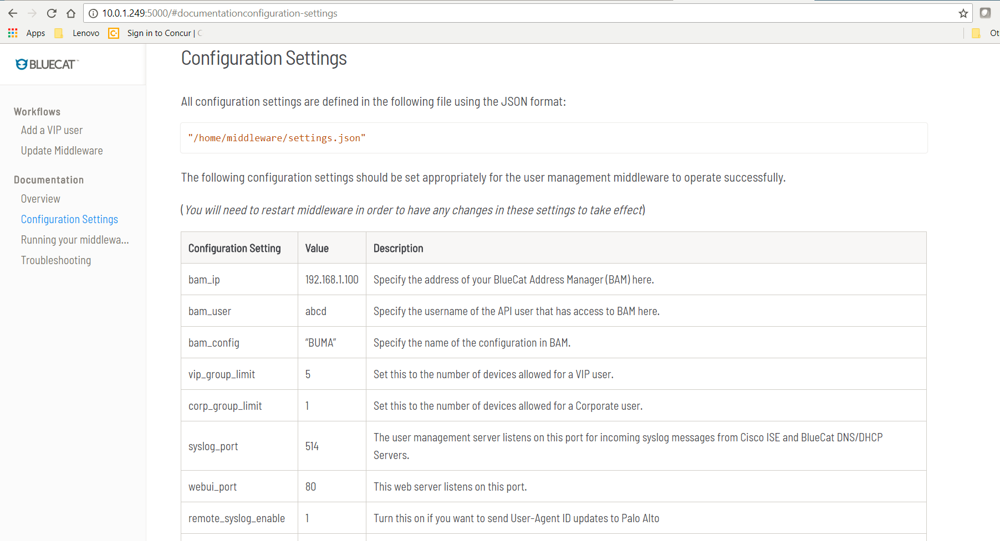

# Identity Bridge 

Identity Bridge is a simple integration between BlueCat Address Manager (BAM), Cisco Identity Services Engine (ISE) and Palo Alto firewalls, to identity users by IP address or MAC address.

It consists of two components:
 - a NodeJS service that listens for syslog messages from ISE, (or any other network access control system that provides a syslog feed), and stores user information in BlueCat Address Manager.
 - a web-server for documentation

When IP addresses are assigned to registered devices by DHCP, Identity Bridge passes the user to IP address mapping to Palo Alto network firewalls, via a standard syslog interface.

## Data representation in Address Manager

Tag objects are created in Address Manager to represent each user. These Tags are linked to the MAC Addresses of network devices that have been authenticated by that user.

## Installation

Pre-requisite: Identity Bridge requires NodeJS to be installed on Ubuntu Linux.

Run setup.js using nodejs
`node setup.js`

Run webserver.js using nodejs
`node webserver.js`

Create an API user in Address Manager for use by the middleware.

## Configuration

All configuration settings required by Identity Bridge are placed in the file `settings.json`
Users can go to `http://identity-bridge-ip:5000/` for detailed documentation. Please use port 5000 or 80 as defined in settings.json to access this page.

## Usage

In order to start the service, run

`service middleware start`

In order to stop the service, run

`service middleware stop`

Logs are written to:

`/var/log/middleware.log`

## Overview of files

- webui (*Directory consists of the static web UI generated by Jekyll*)
- setup.js (*setup script*)
- settings.json (*All customer configuration settings go in here*)
- webserver.js (*The main file that is run when middleware starts*)
- middleware.js (*The main syslog server and logic is here*)
- bam.js (*All BlueCat API calls are in here*)

## License

Copyright 2018 BlueCat Networks (USA) Inc. and its affiliates

Licensed under the Apache License, Version 2.0 (the "License");
you may not use this file except in compliance with the License.
You may obtain a copy of the License at

    http://www.apache.org/licenses/LICENSE-2.0

Unless required by applicable law or agreed to in writing, software
distributed under the License is distributed on an "AS IS" BASIS,
WITHOUT WARRANTIES OR CONDITIONS OF ANY KIND, either express or implied.
See the License for the specific language governing permissions and
limitations under the License.
